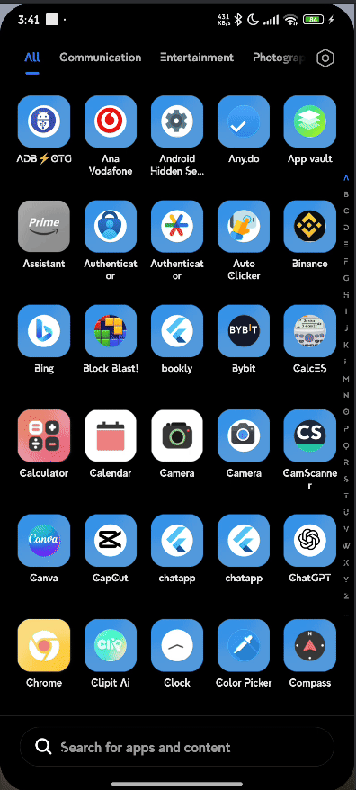

# 🚀 Flutter Native Animated Splash Screen

> Professional native Android splash screen with Lottie animation for Flutter apps



## ✨ Features

- ⚡ **Native Performance** - Pure Kotlin implementation
- 🎨 **Lottie Animations** - Beautiful, lightweight animations  
- 🔧 **Easy Customization** - Full control over animation properties
- 🛡️ **Error Handling** - Graceful fallback if animation fails
- 📱 **Hardware Accelerated** - GPU rendering for smooth performance
- 🔄 **Infinite Loop** - Animation repeats until app loads

## 📖 Step-by-Step Setup

### 1️⃣ Add Dependencies

Add these dependencies to `android/app/build.gradle.kts`:

```kotlin
dependencies {
    implementation("org.jetbrains.kotlin:kotlin-stdlib:1.9.24")
    implementation("com.airbnb.android:lottie:6.4.0")
    implementation("androidx.appcompat:appcompat:1.7.0")
    implementation("androidx.core:core-ktx:1.13.1")
}
```

> **Note:** If the dependencies section doesn't exist, add it at the end of the file.

### 2️⃣ Download Lottie Animation

1. Visit [lottiefiles.com](https://lottiefiles.com/)
2. Choose your desired animation
3. Click **Download** (green button, top right/left)
4. Select workspace or create a new one → **Save**
5. In the opened page, click the download arrow (top left)
6. Choose **Lottie JSON** format
7. Download the file

### 3️⃣ Create Assets Folder

Create a new folder: `android/app/src/main/assets/`

Put your downloaded animation file inside this folder (rename it to `splash.json`)

### 4️⃣ Create SplashActivity

Navigate to: `android/app/src/main/kotlin/com/example/<yourapp_name>/`

> **Example path:** `android/app/src/main/kotlin/com/example/chatapp/`

Create a new file: `SplashActivity.kt`

**📁 Files in this repo:**
- [`SplashActivity.kt`](android/app/src/main/kotlin/com/example/chatapp/SplashActivity.kt) - Copy this file to your project.  
  **💡 Tip:** You can freely modify this file to adjust how the animation is displayed, including background color, duration, speed, repeat count, and transition effects.
- [`MainActivity.kt`](android/app/src/main/kotlin/com/example/chatapp/MainActivity.kt) - Basic Flutter activity

### 5️⃣ Update AndroidManifest.xml

Open `android/app/src/main/AndroidManifest.xml`

Add this activity **above** the MainActivity:

```xml
<activity
    android:name=".SplashActivity"
    android:exported="true"
    android:theme="@style/Theme.AppCompat.Light.NoActionBar">
    <intent-filter>
        <action android:name="android.intent.action.MAIN"/>
        <category android:name="android.intent.category.LAUNCHER"/>
    </intent-filter>
</activity>
```

**📁 Example file:** [`AndroidManifest.xml`](examples/AndroidManifest.xml)

### 6️⃣ Run Your App

```bash
flutter clean
flutter pub get  
flutter run
```

## 🎨 Customization Options

The `SplashActivity.kt` file includes detailed comments for customizing:

### Background Color
```kotlin
// White background (default)
container.setBackgroundColor(0xFFFFFFFF.toInt())

// Custom colors
container.setBackgroundColor(0xFF1976D2.toInt()) // Blue
container.setBackgroundColor(0xFF000000.toInt()) // Black
container.setBackgroundColor(0xFFE91E63.toInt()) // Pink
```

### Animation Speed
```kotlin
speed = 1.0f    // Normal speed
speed = 1.5f    // 1.5x faster (default)
speed = 0.5f    // Slower
speed = 2.0f    // 2x faster
```

### Animation Repeat
```kotlin
repeatCount = LottieDrawable.INFINITE  // Infinite loop (default)
repeatCount = 0                        // Play once
repeatCount = 3                        // Repeat 3 times
```

### Splash Duration
```kotlin
val splashDuration = 3000L  // 3 seconds (default)
val splashDuration = 2000L  // 2 seconds
val splashDuration = 5000L  // 5 seconds
```

### Render Mode (Performance)
```kotlin
setRenderMode(RenderMode.HARDWARE)  // GPU rendering (default)
setRenderMode(RenderMode.SOFTWARE)  // CPU rendering (for older devices)
```

### Transition Effects
```kotlin
// Fade transition (default)
overridePendingTransition(android.R.anim.fade_in, android.R.anim.fade_out)

// Slide transition
overridePendingTransition(android.R.anim.slide_in_left, android.R.anim.slide_out_right)
```

## 📁 Project Structure

```
android/
├── app/
│   ├── src/main/
│   │   ├── assets/
│   │   │   └── splash.json                 # Your Lottie animation
│   │   ├── kotlin/com/example/chatapp/
│   │   │   ├── SplashActivity.kt          # Splash screen logic
│   │   │   └── MainActivity.kt            # Flutter activity
│   │   └── AndroidManifest.xml            # App configuration
│   └── build.gradle.kts                   # Dependencies
```

## 🐛 Troubleshooting

**❌ Animation not showing?**
- Check if `splash.json` exists in `android/app/src/main/assets/`
- Verify the animation file is valid JSON

**❌ App crashes on startup?**
- Ensure package names match in all files
- Check Lottie dependency is properly added
- Clean and rebuild: `flutter clean && flutter run`

**❌ Poor animation performance?**
- Try `RenderMode.SOFTWARE` for older devices
- Reduce animation complexity or file size
- Use smaller Lottie files (<500KB recommended)

## 🎯 Tips for Best Results

- **Animation file size:** Keep under 500KB for best performance
- **Animation duration:** 2-4 seconds works best for splash screens
- **Test on real devices:** Emulators may not show true performance
- **Use simple animations:** Complex animations may lag on low-end devices

## 📄 License

MIT License - Feel free to use in your projects!

---

⭐ **If this helped you, please give it a star!**

🤝 **Contributions welcome!** Feel free to submit issues and pull requests.
